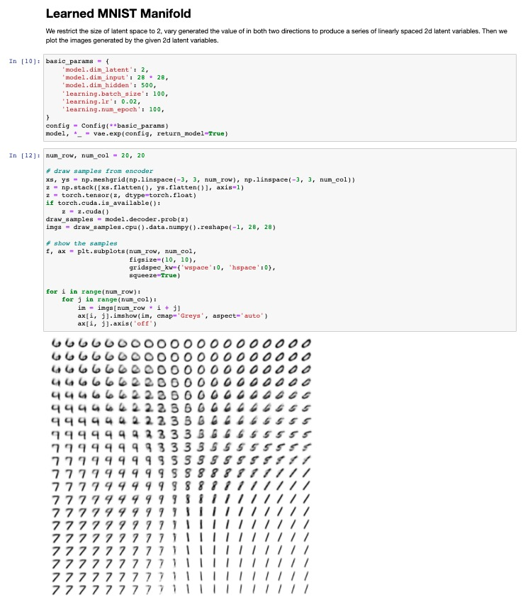

# Machine Learning Paper Reproduction

## Quick Start
```
git clone https://github.com/jz95/ml-paper-lab.git

# install paperlab in developer mode 
cd ml-paper-lab & python setup.py develop

# launch jupyter and play with the notebook
cd notebooks & jupyter notebook
```

## Reproduced papers

|full paper name|alias|notebook|year|domain|
|---------------|-----|--------|----|------|
|[Modeling Task Relationships in Multi-task Learning with Multi-gate Mixture-of-Experts](https://www.kdd.org/kdd2018/accepted-papers/view/modeling-task-relationships-in-multi-task-learning-with-multi-gate-mixture-)|google mmoe|[mmoe](notebooks/mmoe.ipynb)|2018|rec sys|
|[Variational Inference: A Review for Statisticians](https://arxiv.org/abs/1601.00670)|-|[cavi_gmm](notebooks/cavi_gmm.ipynb)|2018|probabilistic modelling|
|[Auto-Encoding Variational Bayes](https://arxiv.org/abs/1312.6114)|vae|[vae](notebooks/vae.ipynb)|2014|probabilistic modelling|
|[An Image is Worth 16x16 Words: Transformers for Image Recognition at Scale](https://arxiv.org/abs/2010.11929)|vit|[vit](notebooks/vit.ipynb)|2020|computer vision|

## Preview
<div align="center"> 



</div>
